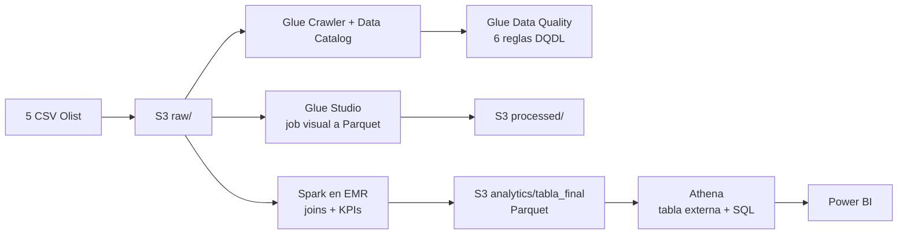

# Pipeline Big Data en AWS: logística y satisfacción en e-commerce (Olist)

Pipeline **batch de extremo a extremo** sobre AWS: desde cinco CSV hasta un dashboard en Power BI. Reto final del módulo de Big Data del Certificado en Big Data & IA (UAX), Ruta B (Batch)

**Dataset:** [Brazilian E-Commerce Public Dataset by Olist](https://www.kaggle.com/datasets/olistbr/brazilian-ecommerce) (99.442 pedidos, 2016-2018). Los CSV no se incluyen en este repositorio: descárgalos desde Kaggle y revisa su licencia.

> **Contexto honesto:** se desarrolló en un entorno de laboratorio de AWS Academy (los recursos se eliminan al reiniciar la sesión). El dataset es pequeño: el objetivo era demostrar el flujo completo y las decisiones de arquitectura, no una escala masiva.

## Preguntas de negocio

- ¿Qué porcentaje de pedidos se entrega fuera del plazo estimado y en qué regiones?
- ¿Qué categorías generan más ingresos y volumen?
- ¿Cómo evolucionan las ventas en el tiempo?
- ¿Cuál es la satisfacción media y cómo varía por categoría?
- ¿En qué estados hay más actividad de compra?

## Arquitectura

El resultado de Athena se exporta a CSV para Power BI (mejora pendiente: conector ODBC directo).

## Stack

Amazon S3 · AWS Glue (Data Catalog, Data Quality, Studio) · Apache Spark 4.0.2 en Amazon EMR (`emr-spark-8.0.0`) · Amazon Athena · Power BI · Python / PySpark · Parquet

## Contenido

| Ruta | Qué es |
|---|---|
| `src/spark_olist_pipeline.py` | Job de PySpark: une 5 tablas, calcula KPIs y escribe Parquet en `analytics/tabla_final/` |
| `dashboard/ProyectoBigData_Dashboard.pbix` | Dashboard de Power BI (requiere Power BI Desktop) |
| `docs/img/` | Capturas de cada fase |

## Cómo se ejecutó

1. Crear el bucket en S3 con las zonas `raw/`, `processed/`, `analytics/` y `dq-results/`, y subir los CSV a `raw/`.
2. Catalogar las tablas con un crawler de Glue (el crawler infirió `col0, col1…` en lugar de los nombres reales; hubo que corregir el esquema a mano).
3. Ejecutar un ruleset de Glue Data Quality sobre `orders`: 6/6 reglas superadas, 99.442 filas.
4. Job de Glue Studio que limpia y guarda `orders` en Parquet en `processed/`.
5. Crear un cluster EMR y lanzar `spark_olist_pipeline.py` como *step*.
6. Crear una tabla externa en Athena sobre `analytics/tabla_final/` y validar con SQL.
7. Construir el dashboard en Power BI.

El script define el bucket en la variable `BUCKET`; cámbialo por el tuyo.

## Resultados

- **AL (Alagoas)** tiene la mayor tasa de entregas fuera de plazo: **23,93 %**.
- **beleza_saude** es la categoría con más ingresos (más de 1,25 millones).
- **relogios_presentes** tiene el precio medio por pedido más alto.
- **Libros** es la categoría mejor valorada (4,47 / 5).
- Las ventas crecen entre 2016 y 2018, con una aceleración notable en 2017.

## Problemas encontrados

- Algunas columnas numéricas de `order_items` traían valores con formato de fecha. `cast` fallaba; se resolvió con `try_cast`, que devuelve `NULL` en lugar de romper el job.
- El crawler de Glue no reconoció las cabeceras en todas las sesiones.

## Limitaciones conocidas

- En el script, `F.first("product_id")` conserva un solo producto por pedido. Si un pedido tiene varias categorías, todo su ingreso se atribuye a una. Para un análisis exacto por categoría habría que unir categorías a nivel de ítem y agregar después.
- Sin orquestación ni particionado.

## Mejoras posibles

- Automatizar con Glue Workflows o Apache Airflow.
- Particionar en S3 por año y mes para reducir el escaneo de Athena.
- Conectar Power BI directamente a Athena (ODBC).
- Modelo para predecir pedidos con riesgo de retraso.

## Autora

Fátima Lesme Ayala · [LinkedIn](https://www.linkedin.com/in/fatima-lesme) · Madrid
